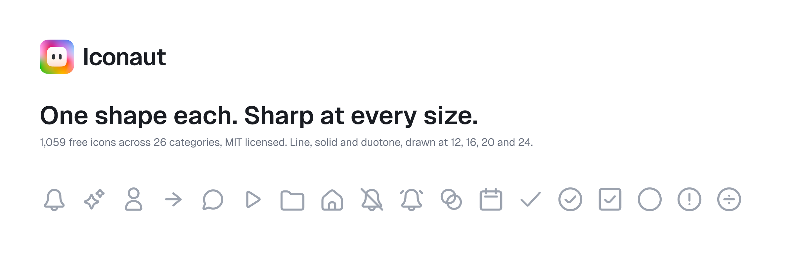

# Iconaut icons

1,059 free icons in **line, solid and duotone**, drawn on one 24px grid, with a real
drawing at every native size. MIT licensed.

**[Browse them](https://iconaut.design/icons)** · [iconaut.design](https://iconaut.design) · `npm i iconaut-react`

## Install

```bash
npm i iconaut-react
```

```jsx
import { Bell, BellSolid, BellDuo } from "iconaut-react";

<Bell />                    // the 24px fit
<Bell size={12} />          // the REAL 12px drawing, not the 24px one scaled down
<Bell strokeWidth={1.25} /> // override the fit's optical stroke
<Bell className="text-blue-500" />
```

Or take the SVGs: they are plain files with no wrapper, and every path takes
`currentColor`, so an icon inherits whatever text colour is in scope.

## What is in here

| Path | What |
|------|------|
| `icons/<category>/<name>/<size>/{line,solid,duo}.svg` | Every icon, at its four native fits. |
| `data/icons.json` | Names, categories, keywords, and the per-size stroke tokens. |
| `packages/react/` | The generated `iconaut-react` package. |

## A real drawing at every size

Most icon sets ship one drawing and scale it, so a 12px icon is a 24px icon with hairline
strokes and detail too fine to read. These are authored as **native fits**: each of 12 / 16 /
20 / 24 has its own stroke token, and below 17px a simplified *compact* drawing takes over on
the icons that carry fine detail.

| size | tier | stroke |
|---|---|---|
| 12 | compact | 1 |
| 16 | compact | 1.125 |
| 20 | default | 1.4 |
| 24 | default | 1.7 |

## One shape per icon

Each icon is one closed vector shape. `line` strokes it; `solid` fills the same shape, so it
registers exactly under the line; `duo` fills it at 25% and strokes it on top. That is also
what makes them swap-safe in Figma: swapping a component keeps the colours you set on it.

## 1,059 free, and the rest

These 1,059 icons, in 26 categories, are free under MIT and stay that way — a
category that shipped free never becomes paid. The specialised Pro packs are not in this
repository; they ship in the [Figma plugin](https://www.figma.com/community/plugin/1654947060820411920) and are licensed separately
(see https://iconaut.design/terms).

## Requests and contributions

Icon requests are welcome — [open an issue](https://github.com/iconaut-design/icons/issues) and say what you need and where
you would use it. Please read [CONTRIBUTING.md](CONTRIBUTING.md) before opening a pull
request: **this repository is generated**, so a patch to a file here cannot be merged.

## Licence

[MIT](LICENSE). Use them in personal and commercial work, modify them, ship them in a
product. Attribution is appreciated and never required.

---
Generated from the Iconaut source of truth. Do not hand-edit; see CONTRIBUTING.md.
